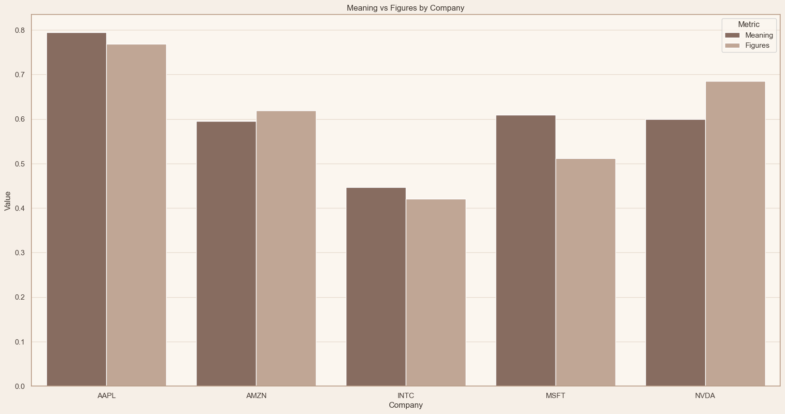
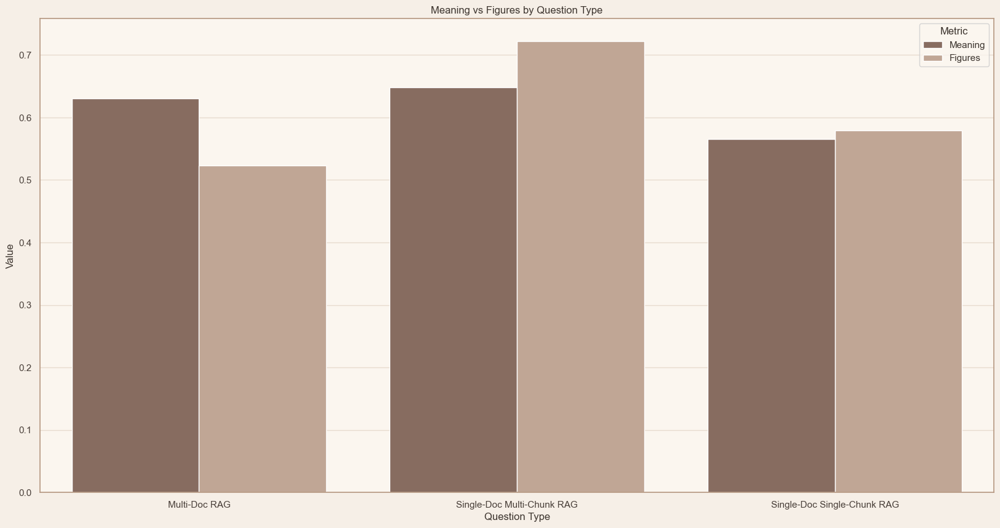
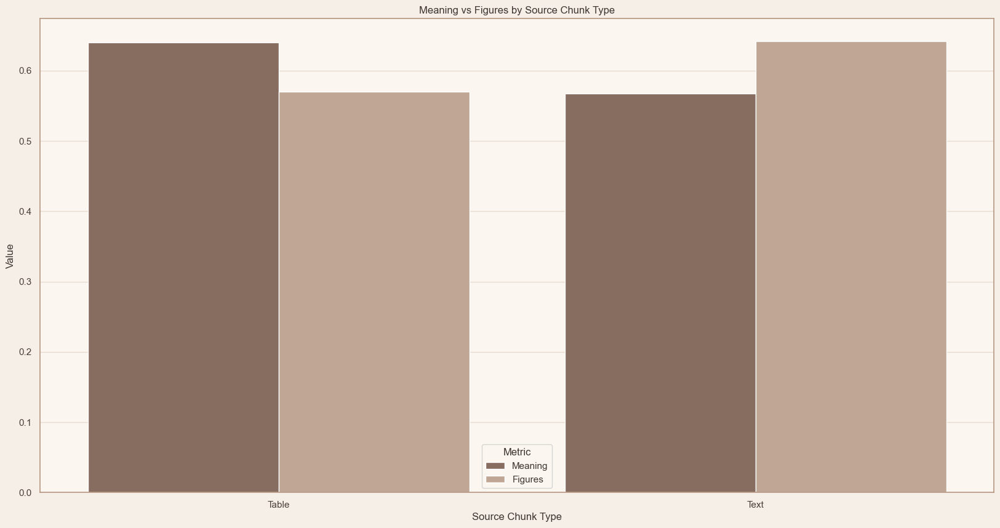

# RAG System for FORM-10Q SEC files

Repository serves as RAG (Retrieval Augmented Generation) QA system.
Deliverable is a composed asynchronous microservice of [FastAPI](https://github.com/fastapi/fastapi) endpoint
and [Qdrant](https://qdrant.tech/) database.



## Table of contents
- [Installation](#installation)
- [Project structure](#project-structure)
- [Pipeline](#pipeline)
- [Notes & insights during development](#notes--insights-during-development)
- [Results](#results)
- [Resources & Inspirations](#resources--inspirations)

## Installation

### Development Version:
- Clone repository:
`git clone https://github.com/sixamsunriseee/rag-form10q.git`

- Sync virtual environment with [uv](https://github.com/astral-sh/uv):
`uv sync`

### Docker:
- Build image from root directory: 
`docker build -t IMAGE_NAME .`

- Run docker image:
`docker run -d -p 8000:8000 IMAGE_NAME`


## Project structure
```
├── notebooks                      <- Jupyter notebooks for exploratory analysis and pipeline creation.
│   ├── parsers                    <- Jupyter notebooks for parsing library explorations.
│   │   ├── marker.ipynb           <- marker library exploration.
│   │   ├── pdfplumber.ipynb       <- pdfplumber library exploration.
│   │   └── unstructured.ipynb     <- unstructured library exploration.
│   │
│   ├── 1. chonkie.ipynb           <- chonkie library exploration.
│   ├── 2. eda_questions.ipynb     <- EDA on provided datasets with questions and answers.
│   ├── 3. parse_and_load.ipynb    <- Notebook for multiple docs parsing and different chunkings.
│   └── 4. system_analysis.ipynb   <- Testing system results and accuracies based on references.
│
├── src                            <- Source code for the project.
│   ├── chunker                    <- Logic for splitting text/documents into smaller chunks.
│   │   ├── base.py                <- Base classes and interfaces for chunking.
│   │   └── text.py                <- Text-specific chunking implementations.
│   │
│   ├── embedding                  <- Embedding generation modules.
│   │   ├── base.py                <- Base embedding interface.
│   │   ├── fastembed_.py          <- Embeddings using the FastEmbed library.
│   │   ├── openai_.py             <- Embeddings via OpenAI API.
│   │   └── qwen.py                <- Embeddings via Qwen API.
│   │
│   ├── llm                        <- Large Language Model interaction layer.
│   │   ├── base.py                <- Base LLM interface.
│   │   ├── openai_.py             <- OpenAI LLM integration.
│   │   └── qwen.py                <- Qwen LLM integration.
│   │
│   ├── parser                     <- Document parsing modules.
│   │   ├── base.py                <- Base parser interface.
│   │   ├── markdown.py            <- Markdown file parsing.
│   │   └── text.py                <- Plain text parsing.
│   │
│   ├── vec_database               <- Vector database implementations and utilities.
│   │   ├── base.py                <- Base vector database interface.
│   │   ├── dense.py               <- Dense vector storage.
│   │   └── hybrid.py              <- Hybrid search implementations.
│   │
│   ├── api.py                     <- FastAPI endpoint.
│   ├── inference.py               <- Inferencing, responds with answer and chunks based on query.
│   ├── schema.py                  <- Data schema definitions.
│   └── util.py                    <- Helper utilities.
│
├── test                           <- Tests.
│   └── test_openai.py             <- Gives verdicts to generated answers from dataframe.
```

## Pipeline

### Parse & Load
1) Documents are parsed to text using pdfplumber.
2) Using SentenceChunker, we split parsed text into chunks of 1024 characters (appx. 256 tokens).
3) For metadata filtering, those chunks are enriched with index of split, company, year, quarter and filename.
4) Enriched chunks are then loaded to vector database.

### Application

1) Query (question) is decomposed into multiple sub-queries. Each sub-query relates only to one document.
2) For each sub-query LLM finds route to it (metadata: company + year + quarter).
3) Based on query and route, we retrieve chunks only for 1 specific document.
4) Retrieve stage is hybrid. Prefetch is generated from dense and sparse embeddings. Then they are reranked with late-interaction embeddings.
5) Retrieved chunks are then sorted (as how they were in original document).
6) Sorted chunks are then bundled, each chunk is prepended and appended with its neighbours.
7) Resulting set of sub-queries and chunks are then passed to LLM with original query.
8) Each sub-query and its related chunks are answered separately. Those answers serve as supporting context for final answer.
9) Given that context and original query, LLM makes final answer.


## Notes & insights during development
1) Embedding models do not make much difference, "sentence-transformers/all-MiniLM-L6-v2" works very well.
2) Restoring order of retrieved chunks is crucial and improves accuracy a lot, as well as bundling.


## Results

1) **Intel company was the worst in terms of accuracy, because it has lots of plots in original document rather than tables or text.** 


2) **Because of multi-chunk retrieval and query decomposition, Single-Doc Multi-Chunk is most performant.**



3) **Even though there was no special handling for tables, it still performed very well with GPT 4.1 nano.**



## Resources & Inspirations
- [FinSage: A Multi-aspect RAG System for Financial Filings
Question Answering](https://arxiv.org/pdf/2504.14493)
- [Antropic Contextual Retrieval](https://www.anthropic.com/news/contextual-retrieval)
- [Long-Context Isn't All You Need: Impact of Retrieval and Chunking on Finance RAG](https://www.snowflake.com/en/engineering-blog/impact-retrieval-chunking-finance-rag/)
- [Qdrant Tutorials](https://qdrant.tech/documentation)
- [IBM Technology - RAG & AI Understanding](https://www.youtube.com/@IBMTechnology/playlists)
- [3Blue1Brown - Neural Networks (Collection)](https://www.youtube.com/watch?v=aircAruvnKk&list=PLZHQObOWTQDNU6R1_67000Dx_ZCJB-3pi)